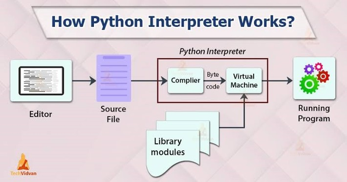

# How Python Runs Your Code

### Your Code (e.g., `example.py`):  
A Python file that contains your source code, like:  
```python
print("Hello World")
```

---

### Interpreter / Part of CPython Implementation:  
The interpreter is the program that runs your Python code.  
**CPython** is the **default** and most widely used implementation of Python, written in **C**. The interpreter, a key part of CPython, executes bytecode, whether it’s from a `.pyc` file or generated in memory. When you install Python from [python.org](https://python.org), you get the CPython implementation.

---

### Lexing & Parsing:  
Before running the code, Python **analyzes** it in two steps to understand its structure:  
- **Lexing**: Breaks code into tokens (e.g., `print`, `"Hello World"`).  
- **Parsing**: Arranges these tokens into a tree-like structure called an **AST** (Abstract Syntax Tree), which represents the logic and flow of your code.

---
### Bytecode and Compilation

 The AST is then compiled into **bytecode**, a low-level, platform-independent set of instructions. This bytecode is generated in memory and executed immediately by the Python Virtual Machine (PVM).

For modules that are imported into the main script, the bytecode is saved to disk in a `.pyc` file inside the `__pycache__` directory. This caching speeds up future imports by avoiding the need to recompile the module every time it is loaded.

> 🔹 Note: The `.pyc` file is only written in disk when a module (e.g, `.py` file) is imported, Running the main script directly (e.g, without any imported `.py` file) only uses in-memory bytecode.

> 🔹 Bytecode is **not machine code**—it’s an intermediate representation that Python understands.

---

### Python Virtual Machine (PVM):  
The **PVM** is the runtime engine that **reads and executes** the bytecode instruction by instruction. It’s a core part of the Python interpreter.  
It interacts with the OS, manages memory, handles I/O, and displays output (like `"Hello World"` on the screen).

---

### Compiler & PVM Are Both Parts of the Python Interpreter  
The **Python interpreter** consists of two essential components:  
- 🔸 A **compiler** that translates `.py` files into bytecode.  
- 🔸 The **PVM** that executes that bytecode.

## This Is the Flow of the Whole Process
> **Your code** → **Lexer & Parser** → **AST** → **Compiler** → **Bytecode** → **PVM** → Output  

---

### What About JIT?  
- **CPython** doesn’t use **JIT** (Just-In-Time compilation) by default; it **interprets** bytecode directly. Other implementations like **PyPy** use JIT for better performance.  
- However, **CPython** is experimenting with JIT! In CPython 3.13, a JIT compiler is being developed, but as of **April 7, 2025**, it’s experimental and disabled by default. Learn more here: [What docs say about **JIT**](https://docs.python.org/3/whatsnew/3.13.html#an-experimental-just-in-time-jit-compiler).

### CPython vs. JIT: How They Work
**CPython** compiles Python source code into bytecode once, then interprets it step by step using the Python Virtual Machine (PVM). It’s a slow process no machine code is made directly.

**JIT** compiles code into machine code during runtime, and reusing the most used parts of the program. 

**CPython** keeps things simple; **JIT** focuses on speed.
### Diagram



#### Used 50% AI & 50% Human Understanding & Time
