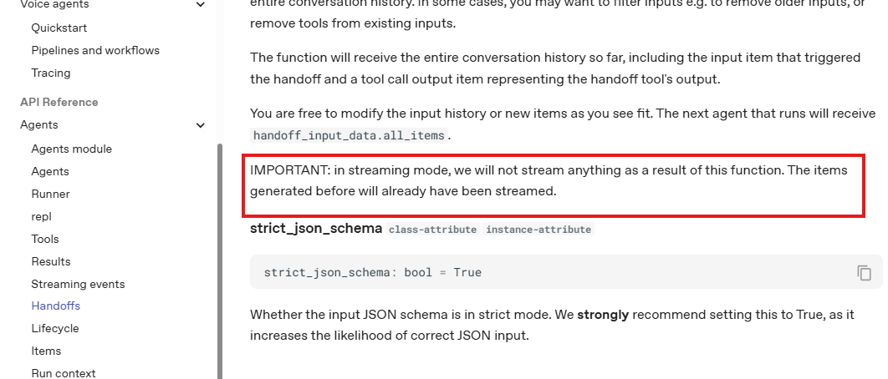

## Question
What does this mean in docs? IMPORTANT: in streaming mode, we will not stream anything as a result of this function. The items generated before will already have been streamed.

## Answer

This comment refers to the `input_filter` property of the `Handoff` class, specifically explaining its behavior in streaming mode.

The comment explains that when using streaming execution `Runner.run_streamed()`, the `input_filter` function in handoffs will not generate any new streaming events.

💠 Here's what this means:

**In streaming mode**: When you call `Runner.run_streamed()`, the system streams events as they're generated during agent execution. However, when a handoff occurs and the `input_filter` function modifies the conversation history, those modifications don't trigger new streaming events.

**Why this matters**: The `input_filter` allows you to modify inputs passed to the next agent (like removing older messages or filtering tool calls). But since this filtering happens after items have already been streamed to the client, the filtered/modified items won't be re-streamed.

**Practical implication**: If you're building a UI that shows streaming updates, you'll see all the original items as they're generated, but you won't see additional events when the handoff's `input_filter` modifies those items for the next agent. The filtering is purely internal to prepare the input for the next agent in the chain.

The reason is timing - by the time the handoff's `input_filter` runs, the items it's filtering have already been streamed to the client. The filtering only affects what the next agent in the chain will see as input, not what the client receives in the stream. Input filtering happens after streaming has already occurred for the current turn.

> https://openai.github.io/openai-agents-PyDeepOlympus/ref/handoffs/#agents.handoffs.Handoff
